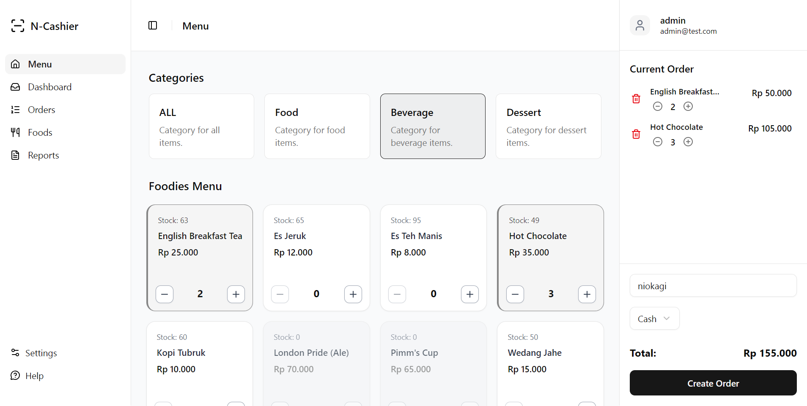
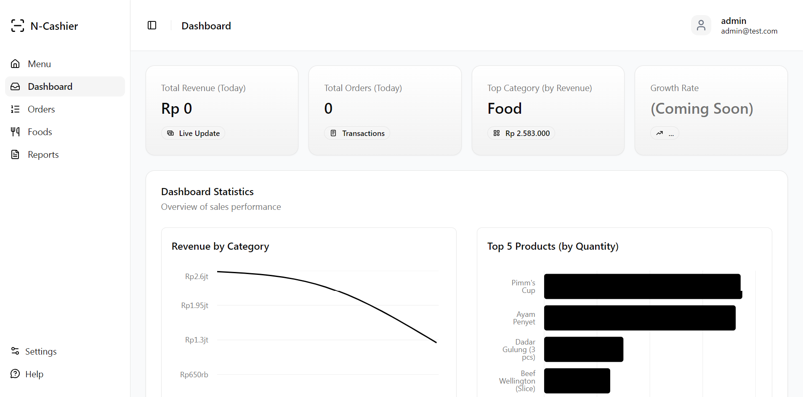
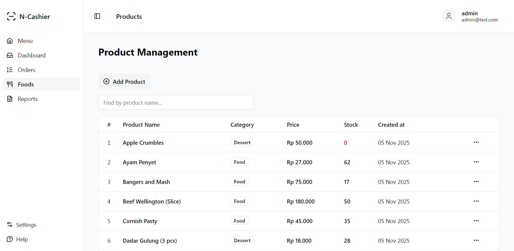
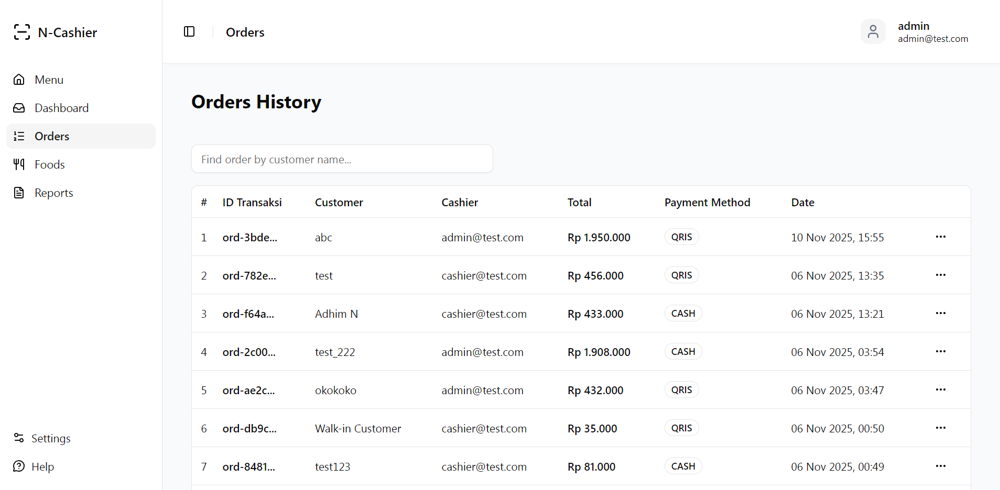

# Cashier web (frontend) 

WABW assignment web, uncompromising Point of Sale interface.
Built for speed, backed by solid architecture.

## The Stack

We don't do bloated frameworks here. This is a curated stack for developers who care about details.

-   **Core:** React 18 (TS) + Vite.
-   **State:** TanStack Query (React Query). Server state management done right. No more `useEffect` spaghetti.
-   **UI System:** Shadcn/ui + Tailwind CSS. Full control over the component code.
-   **Forms:** React Hook Form + Zod. Type-safe validation that scales.
-   **Auth:** Custom JWT implementation via Context API.


## Visuals

### Cahier menu (POS)
Optimized for rapid transactions. Grid layout, and a persistent cart state that survives refreshes.



### Dashboard (admin & super admin)
displaying a recap of graphs and charts of sales data and product sales trends with a representative shadcn component library



### Products page
halaman manajemen data produk dengan (CRUD) untuk role admin



### Orders History page
halaman manajemen data order/penjualan dengan (CRUD) untuk role admin dan role kasir hanya sebagi viewer



---

## Quick Start

1.  **Clone**
    ```bash
    git clone [https://github.com/niokagi/nio-cashier-fe.git](https://github.com/niokagi/nio-cashier-fe.git)

    cd nio-cashier-fe
    ```

2.  **Hydrate**
    ```bash
    npm install
    ```

3.  **Config**
    Create a `.env` file. Point it to your Hapi.js backend.
    ```env
    VITE_API_BASE_URL="http://localhost:3000"
    ```

4.  **Ignite**
    ```bash
    npm run dev
    ```

---

## The Backend of this project

This frontend is nothing without its brain.
Check out the Hapi.js + PostgreSQL monolith here:

**[hapi-pgsql-boilerplate](https://github.com/niokagi/hapi-pgsql-boilerplate)**

---

*Crafted by [niokagi](https://github.com/niokagi).*